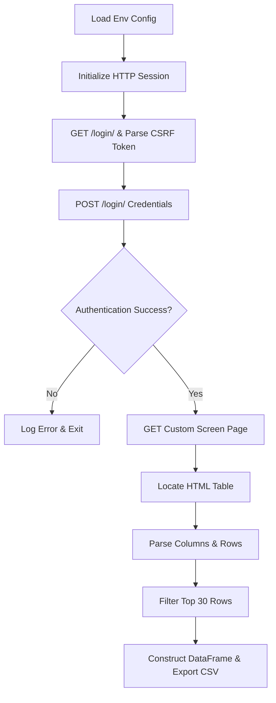
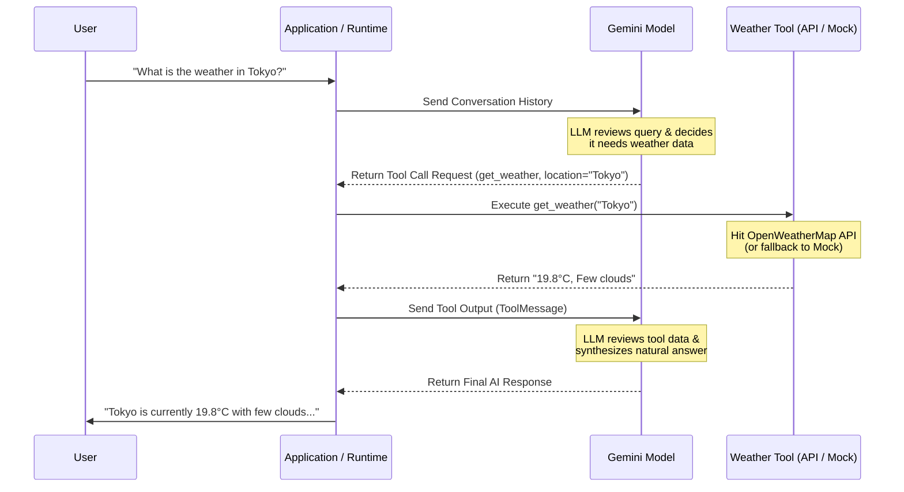

# Agentic AI & Automation Learning Journey

Welcome to the **Agentic AI & Automation** learning repository! This project serves as a step-by-step diary and codebase for learning how to build agentic workflows, work with Large Language Models (LLMs), build web APIs, and automate tasks.

Each learning milestone is structured into numbered files (`00_`, `01_`, `02_`, etc.), with detailed inline comments explaining the core programming concepts, design decisions, and LLM automation logic.

---

## 🗺️ Learning Roadmap & Code Directory

Here is the structured sequence of learnings, with direct links to the source files for easy navigation:

| Step | Topic / Feature | File Link | Key Concepts Learned |
|:---|:---|:---|:---|
| **00** | **Prerequisites & Env Setup** | [00_prerequisites.md](00_prerequisites.md) | Installing Python, configuring `uv` (Rust-based environment manager), virtual environment isolation (`.venv`), package installation, and shell activation. |
| **01** | **FastAPI Basics** | [01_fastapi_basic.py](01_fastapi_basic.py) | Creating a basic web API, understanding decorators, HTTP `GET` requests, asynchronous routing (`async def`), and running servers using `uvicorn --reload`. |
| **02** | **File Uploads & Data Parsing** | [02_fastapi_upload_csv.py](02_fastapi_upload_csv.py) | Handling multipart file uploads using `UploadFile` and `File` in FastAPI, streaming files without loading into RAM, and reading files into Pandas DataFrames. |
| **03** | **LLM Chat Integration** | [03_simple_gemini_chat.py](03_simple_gemini_chat.py) | Connecting to Google's Gemini models using `langchain-google-genai` and `ChatGoogleGenerativeAI`, configuring API keys, loading environments, and model invocation. |
| **04** | **Screener Web Scraper** | [04_scrape_screener.py](04_scrape_screener.py) | Authenticating programmatically with CSRF-protected forms, persistent sessions, handling anti-scraping User-Agent headers, BeautifulSoup parsing, and exporting to CSV. |
| **05** | **LangChain Tool Calling** | [05_langchain_invoke_tool.py](05_langchain_invoke_tool.py) | Creating AI agents using LangChain tools, binding tools to Gemini models (`bind_tools`), manual execution loop, and fallback logic using the free OpenWeatherMap 2.5 API. |
| **Helper** | **Main Entry Point Idiom** | [main.py](main.py) | Understanding the standard Python entry point check `if __name__ == "__main__":` for standalone execution vs. module imports. |

---

## 🛠️ Detailed Breakdown

### 1. Environment & Project Management
In [00_prerequisites.md](00_prerequisites.md), we learn the fundamental setups:
* **`uv`**: A lightning-fast package manager. Commands include `uv venv` to spawn virtual environments, `uv add <pkg>` to track dependencies, and `uv run <script>` to execute files.
* **Separation of Scope**: Ensuring projects don't conflict by keeping all dependencies local to the `.venv` folder.

### 2. Building APIs with FastAPI
In [01_fastapi_basic.py](01_fastapi_basic.py) and [02_fastapi_upload_csv.py](02_fastapi_upload_csv.py):
* **FastAPI Class**: The main orchestrator of the web application.
* **Asynchronous execution (`async def`)**: Allows high-concurrency requests without blocking CPU cycles.
* **`UploadFile`**: Enables streaming large files to disk/memory dynamically. Useful when processing files like CSVs via Pandas (`pd.read_csv(file.file)`).

### 3. Integrating LangChain and Gemini
In [03_simple_gemini_chat.py](03_simple_gemini_chat.py):
* **`ChatGoogleGenerativeAI`**: LangChain's wrapper around Google Gemini APIs (using the `gemini-3.5-flash` model).
* **`.env` Management**: Security best practice to load the `GOOGLE_API_KEY` dynamically using `dotenv`.

### 4. Screener.in Web Scraper (Case Study)
The script [04_scrape_screener.py](04_scrape_screener.py) represents a practical application of automation:
* **Session Persistence**: Maintains logged-in status using cookies via `requests.Session()`.
* **CSRF Protection Bypass**: Fetches the login page first, extracts the hidden `csrfmiddlewaretoken` input, and posts it along with the user credentials.
* **Robust Table Parsing**: Identifies the target data table, extracts column headers, skips inner/duplicated header rows, slices the top 30 companies, and writes the output to CSV using Pandas.



### 5. LangChain Tool Calling & Agentic AI
In [05_langchain_invoke_tool.py](05_langchain_invoke_tool.py), we advance to Agentic AI by building an LLM program that interacts with external APIs:
* **Tools in LangChain**: Wrapped using the `@tool` decorator, where function signatures and docstrings act as metadata for the LLM.
* **LLM Tool Binding**: Using `llm.bind_tools(...)` to attach schemas to the Gemini model.
* **Agent Execution Loop**: Manually orchestrating the loop (Prompt $\rightarrow$ Tool Call Request $\rightarrow$ Tool Execution $\rightarrow$ Tool Output $\rightarrow$ Final Response) to demystify how agents work under the hood.
* **API Fallback Resilience**: Querying OpenWeatherMap's free 2.5 API (which doesn't require a paid subscription/card setup) with a fallback to mock weather data if the key is missing or invalid.



---

## 🚀 Running Guide

### Installation
Make sure you have `uv` installed, then run:
```bash
uv pip install -r requirements.txt
# Or add packages dynamically
uv add fastapi uvicorn pandas langchain-google-genai python-dotenv beautifulsoup4 requests python-multipart
```

### Config Setup
Create a `.env` file at the root of the project with:
```env
GOOGLE_API_KEY=your_gemini_api_key_here
SCREENER_USERNAME=your_screener_username_here
SCREENER_PASSWORD=your_screener_password_here
SCREENER_SCREEN_URL=https://www.screener.in/screens/3626789/top-30-momentum-stocks/
# Optional: Get a free key from https://openweathermap.org/
# If omitted, the tool falls back to highly realistic mock data automatically
OPENWEATHERMAP_API_KEY=your_openweathermap_api_key_here
```

### Run Examples
- **FastAPI Basics**:
  ```bash
  uv run uvicorn 01_fastapi_basic:app --reload
  ```
- **FastAPI CSV Upload**:
  ```bash
  uv run uvicorn 02_fastapi_upload_csv:app --reload
  ```
- **Gemini Chat**:
  ```bash
  uv run python 03_simple_gemini_chat.py
  ```
- **Screener Scraper**:
  ```bash
  uv run python 04_scrape_screener.py
  ```
- **LangChain Tool Invocation (Agent)**:
  ```bash
  uv run python 05_langchain_invoke_tool.py
  ```

---

## ⚠️ Disclaimer
This codebase is strictly for **educational and self-learning purposes**. Web scraping might violate the Terms of Service of websites; always check their terms before deploying scrapers or automated bots in production.
